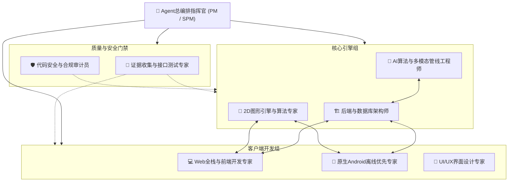
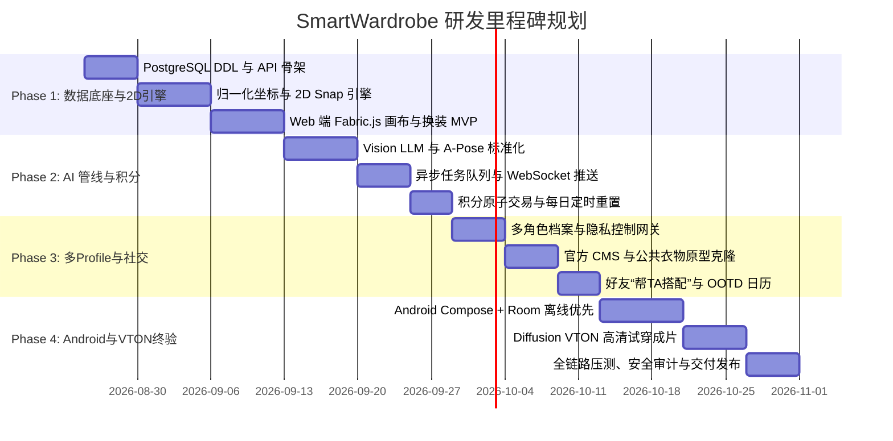

# 智能虚拟衣橱（SmartWardrobe）多 Agent 调度编排与实施规划

本项目基于 **《智能虚拟衣橱与多模态试穿平台（SmartWardrobe）PRD V1.0.0》**，旨在构建一套融合 **2D 极速拼装画布（毫秒级 Canvas 渲染）** 与 **生成式 AI 高清试穿（Diffusion VTON）** 的全栈跨端数字化衣橱系统。

---

## 一、 用户审查要点 (User Review Required)

> [!IMPORTANT]
> **技术栈与开发顺序确认**
> 1. **全栈开发顺序**：推荐优先启动 **Phase 1 (PostgreSQL 数据底座 + 跨端 2D 归一化画布引擎 + Web 客户端 MVP)**，在 2D 核心拼装体验跑通后，再推进 Phase 2 (AI 管线与积分系统) 和 Phase 4 (原生 Android 离线架构)。
> 2. **AI 模型接入方式**：前期开发阶段，AI 管线（Vision LLM、ControlNet A-Pose、Diffusion VTON）可先采用标准 Mock/Stub 服务与真实 API 适配器双轨设计，确保端侧与业务层可独立并行开发与测试。

---

## 二、 专业 Agent 团队编组与职责矩阵 (Agent Squad Matrix)

为了保证系统高内聚、低耦合与高工程质量，总编排指挥官调度以下专职 Agent 团队：

### 1. 核心专职 Agent 角色职责分配

| Agent 角色 | 专职领域 | 核心交付物与职责 |
| :--- | :--- | :--- |
| 👑 **Agent总编排指挥官** | 全流程调度与质量门禁 | 任务分解与依赖编排、Dev ↔ QA 质量循环把控、阶段里程碑验收。 |
| 🏗️ **后端与数据库架构师** | 数据建模与业务微服务 | PostgreSQL 16 物理 DDL 落地、JWT 鉴权、RESTful API、WebSocket 状态推送、积分事务（`FOR UPDATE`）与每日定时重置。 |
| 📐 **2D图形引擎与算法专家** | 跨端几何算法与画布渲染 | 0.0~1.0 归一化虚拟坐标转换公式、欧氏距离骨骼锚点智能吸附引擎（Snap < 0.08）、动态 Z-Index 矩阵与多态控制器（Open/Closed, Tuck-in）。 |
| 🤖 **AI算法与多模态管线工程师** | 视觉模型与异步生成 | Vision LLM 服装自动打标、ControlNet A-Pose 人像标准化、Ghost Mannequin 切片裂变、Diffusion VTON 异步任务与超时退款保护。 |
| 💻 **Web全栈与前端开发专家** | Web 响应式端与 CMS 后台 | React/Vue + Fabric.js 画布交互、响应式（PC+H5）端、Lookbook/OOTD 日历、官方 Web CMS 管理后台。 |
| 📱 **原生 Android 移动端专家** | 原生端与离线优先架构 | Kotlin + Jetpack Compose、Compose Canvas 2D 引擎、Room 本地 SQLite、Coil 磁盘 LRU 缓存与 WorkManager 增量同步。 |
| 🎨 **UI/UX界面设计专家** | 视觉系统与交互规范 | 高质感衣橱 Design System、模特/衣物吸附动效微交互、状态切换栏与进度动效。 |
| 🧪 **证据收集与接口测试专家** | 自动化测试与质量验收 | RESTful/WebSocket 契约测试、积分扣费并发与幂等性测试、2D 画布跨端对齐校验、离线与弱网断点续传测试。 |
| 🛡️ **代码安全与合规审计员** | 数据隐私与逻辑安全 | 多 Profile 隐私越权（Private/Friends/Public）渗透审计、积分防刷与 SQL 事务死锁防范。 |

---

## 三、 四阶段研发实施路线图 (Phased Implementation Roadmap)

### Phase 1: 数据底座与 2D 画布引擎 (第 1-3 周)
* **目标**：实现数据库持久化、跨端 2D 坐标对齐算法与 Web 基础换装画布。
* **分派 Agent**：`后端架构师` + `2D图形引擎专家` + `Web前端专家` + `QA测试专家`。
* **交付清单**：
  1. PostgreSQL 16 数据库结构及初始化脚本。
  2. 2D 归一化坐标系算法库（TypeScript/JavaScript & Kotlin 通用算法规范）。
  3. Fabric.js 2D 拼装画布（支持智能吸附、图层互斥替换、Z-Index 计算、Open/Closed 与 Tuck-in 切换）。
  4. 基础用户登录与 Profile 管理 API。

### Phase 2: AI 管线集成与积分调度 (第 4-6 周)
* **目标**：打通 AI 标准化流水线、异步任务推送与 100 积分原子经济模型。
* **分派 Agent**：`AI算法工程师` + `后端架构师` + `安全审计员` + `QA测试专家`。
* **交付清单**：
  1. Vision LLM 结构化打标（品类、颜色、花纹、版型）与 ControlNet A-Pose 人像标准化服务。
  2. 服装 Ghost Mannequin 切片生成与 Open/Closed 自动裂变。
  3. Redis/PostgreSQL 异步任务调度器与 WebSocket 状态推送服务。
  4. 积分账户事务扣减（`SELECT ... FOR UPDATE`）、超时退款与每日 00:00 批量重置 Cron。

### Phase 3: 多角色 Profile、公共衣柜 CMS 与社交借穿 (第 7-8 周)
* **目标**：完善多角色档案体系、官方公共资产运营与好友互动闭环。
* **分派 Agent**：`Web全栈专家` + `后端架构师` + `UI/UX专家` + `安全审计员`。
* **交付清单**：
  1. 多 Profile 隔离机制与三级隐私控制（Private / Friends / Public）。
  2. 官方 Web Admin CMS（单品批量上传、AI 打标、上架/下架控制）。
  3. 公共衣柜“原型深度克隆（Prototype Clone）”解耦复制机制。
  4. 好友“帮TA搭配”推送机制与 OOTD 穿搭日历。

### Phase 4: 原生 Android 离线优先架构与 VTON 终验 (第 9-10 周)
* **目标**：构建 Android Compose 离线优先 App，打通 Diffusion VTON 高清试穿。
* **分派 Agent**：`原生Android专家` + `AI算法工程师` + `QA测试专家` + `SRE架构师`。
* **交付清单**：
  1. Android Jetpack Compose 客户端与 Compose Canvas 2D 拼装引擎。
  2. Room 本地 SQLite + Coil LRU 磁盘缓存离线浏览与暂存。
  3. WorkManager 后台增量双向同步引擎。
  4. Diffusion VTON 高清试穿渲染流集成与端到端系统验收。

---

## 四、 验证与验收计划 (Verification Plan)

### 1. 自动化与接口验证
- **数据库事务验证**：模拟 100 并发扣减积分测试，验证 `credit_ledger` 流水一致性与零超扣。
- **算法对齐验证**：编写跨端单元测试，验证相同的归一化坐标在不同分辨率物理画布下的对齐误差 $< 0.1\text{px}$。
- **API 契约验证**：使用契约测试覆盖 PRD 中的所有 RESTful 与 WebSocket 接口。

### 2. 人工走查与端到端体验验证
- **2D 画布体验**：测试吸附灵敏度、自由缩放旋转手势、形态切换（敞开/合拢/塞衣角）的流畅度（$\ge 60\text{ FPS}$）。
- **离线模式体验**：模拟 Android 飞行模式，测试离线拖拽、搭配暂存，并在网络恢复后验证自动同步。
