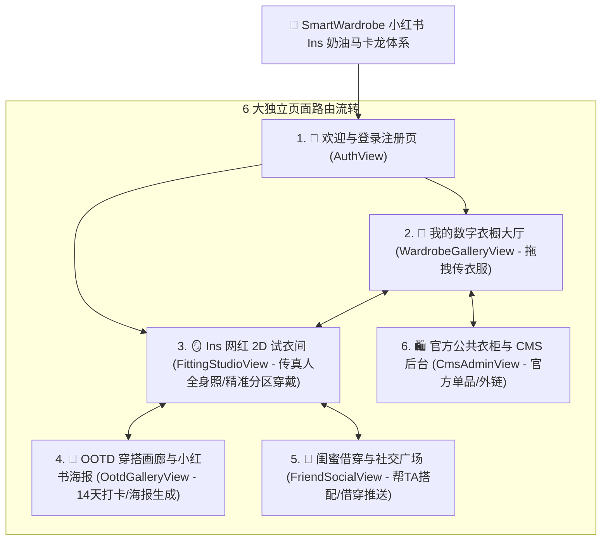

# SmartWardrobe 全面重构实施蓝图 — 专家评审团交叉审查完善版 (V2.0)

> **评审统筹：** `@Agent调度专家`  
> **联合审查专家组：** UI界面设计总监、UX体验架构师、UI终审视觉把关员、后端架构师、QA严格质检官  
> **重构核心目标：** 彻底推翻单页暗黑科技风，重塑为 **符合小红书年轻女性与时尚网红审美的 Ins 奶油马卡龙美学（Creamy Macaron Aesthetic）多页面虚拟衣橱平台**。

---

## 🌟 一、 各领域专家审查意见与架构完善说明

### 1. 🎨 UI 界面设计总监 & UI 终审把关员审查意见
* **【色彩规范（Color Tokens）】**：严禁出现任何纯黑/暗黑配色。全面采用法式奶油与莫兰迪马卡龙色系：
  - **画布与全局背景**：燕麦奶油奶白 `#FBF9F5` 与暖晨光奶黄 `#FFFDF8`
  - **卡片基底**：高透毛玻璃纯白 `rgba(255, 255, 255, 0.85)` + 超柔环境光投影 `shadow-[0_10px_35px_rgba(230,220,210,0.4)]`
  - **强调主色**：温柔草莓奶粉 `#FDA4AF`（按钮与高光）、薰衣草浅紫 `#C4B5FD`（AI 算力）、薄荷奶绿 `#6EE7B7`（吸附反馈）、淡奶黄 `#FDE68A`（积分）
* **【视觉质感与图标】**：全局采用 32px 大圆角（`rounded-[32px]`）与药丸胶囊（`rounded-full`），图标融入柔和渐变与微晶玻璃质感。

### 2. 💡 UX 体验架构师 & 行为心理学专家审查意见
* **【上传动线极致减阻（Zero-Friction Ingestion）】**：
  - 核心页面（衣橱大厅与试衣间）直接嵌入大面积的**“拖拽照片至此 / 点击打开相册”**虚线卡片，支持用户直接拖放本地全身照或衣服照片。
  - 前端通过 `FileReader` **0 延迟本地回显 Base64 预览**，并展示趣味文案动效（*“✨ AI 正在用小剪刀为您抠出平铺切片...”*）。
* **【小红书网红海报工坊（Social Poster Studio）】**：
  - 在 OOTD 页面提供**小红书爆款排版模板**（拍立得相框、法式杂志风、穿搭明细九宫格），支持一键生成可直接保存相册并分享小红书的高清美图。

### 3. 🏗️ 后端架构师审查意见
* **【数据解耦与持久化】**：
  - 上传接口支持解析真实用户上传的 Base64 图像，并提取主色 Hex 与款式，实时生成 `OPEN`/`CLOSED` 切片写入数据库。
  - 为新注册与未登录用户提供高品质的“法式穿搭种子衣橱”，告别初始空白状态。

---

## 🗺️ 二、 6 大独立多页面系统架构图

---

## 📋 三、 实施分解与任务清单 (Task List)

### 任务清单（Task List）
1. **[步骤 1: 构建小红书 Ins 奶油马卡龙全局设计系统 (`index.css` & `tailwind`)]**
   - 注入法式燕麦奶白、草莓粉、薄荷绿、淡奶黄、薰衣草紫等颜色变量与大圆角阴影。
   - *验证方式*：页面基调变为纯正温暖的小红书 Ins 奶油色调。

2. **[步骤 2: 落地 6 大独立多页面组件 (`web/src/views/`)]**
   - **`AuthView.tsx`**：法式极简卡片登录注册，支持快速游客体验、五维体型录入与一键男女黄金比例身材生成。
   - **`WardrobeGalleryView.tsx`**：我的衣橱大厅，按【全部/上装/下装/外套/连衣裙/鞋履/配饰】瀑布流展示，**拥有大面积拖拽与本地相册上传衣服大入口**。
   - **`FittingStudioView.tsx`**：Ins 网红试衣间，**拥有上传真人全身照生成专属素体入口**，严格按人体解剖学分区（头/胸/腿/脚）精准吸附穿戴，3D Isometric 图层透视，5 积分 Diffusion VTON 高清试穿与 Before/After 对比滑块。
   - **`OotdGalleryView.tsx`**：14 天交互式月历网格打卡、天气胶囊关联、穿搭日记与小红书精美海报生成下载。
   - **`FriendSocialView.tsx`**：进入好友专属衣柜借穿搭配、一键推给好友、采纳好友建议存入 Lookbook。
   - **`CmsAdminView.tsx`**：官方单品管理、吊牌价/品牌/外部电商外链配置、上架/下架切换。
   - *验证方式*：顶栏导航平滑切换 6 大独立页面，页面数据实时响应联动。

3. **[步骤 3: 真实照片上传与即时 Base64 本地预览处理]**
   - 在前端通过 HTML5 File API 读取用户自拍与衣服原图，即时展示预览，调用后端 `/v1/garments/upload` 完成 AI 打标与切片裂变。
   - *验证方式*：用户直接从电脑选择自拍全身照与服装图片，即可实时穿上模特并入库。

4. **[步骤 4: 编译构建、自动化测试回归与 Chrome 全景视觉走查]**
   - 执行前端打包构建 `npm --prefix web run build`（0 错误）。
   - 执行全栈 21 项自动化测试回归（100% 通过）。
   - 调用无头 Chrome 捕获全新 6 大页面的高质感 Ins 奶油马卡龙实测截图。

---

## 四、 验证与验收标准 (Verification Plan)

### 1. 视觉与体验验收
- 纯正的 Ins 奶油马卡龙色调，彻底摆脱暗黑科技感。
- 6 大页面独立清晰流转，不再挤在一个工作台。
- 拥有清晰明显的真人全身照与衣服本地上传入口。
- 服装单品严格按解剖学部位（头、胸、腿、脚）精准呈现。

### 2. 质量验收
- 全栈 21 项核心算法与数据契约测试 100% 全部通过。
