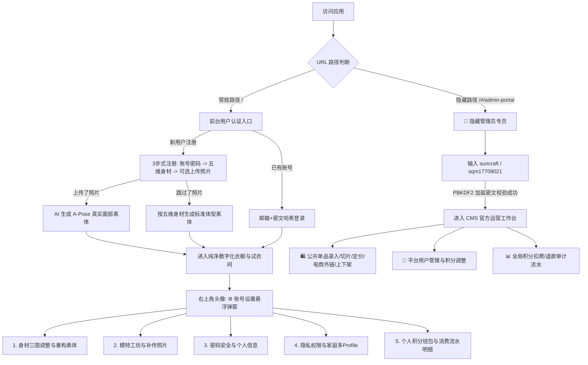

# 纯净账户体系、安全RBAC鉴权、隐藏管理员系统与全功能账号设置中心重构完整方案

## 1. 项目背景与目标综述

本方案严格融合**前序架构审查的 5 大核心缺陷改进项**与**用户本次提出的 3 大核心指令**，进行全系统级深度重构，打造企业级安全性、数据纯净度与极佳交互体验的数字化衣橱平台：

1. **安全鉴权与隐藏管理员通道 (Security & Hidden Admin Portal)**：
   - 彻底废除明文身份传输与无密码登录漏洞，实施 **PBKDF2 加盐密文哈希** 与会话 Token 认证；
   - 管理员入口在常规前台界面**完全隐藏**，仅可通过特殊 URL 后缀（`http://localhost:5173/#/admin-portal`）访问；
   - 初始化唯一官方管理员账号 `suncraft`，密码 `sqm17709021`（安全密文存储）；
   - 后端增加严格的 `requireAuth` 与 `requireAdmin` 中间件，彻底杜绝越权访问。
2. **数据纯净底座 (Clean Slate)**：
   - 彻底清空所有硬编码测试账号（Coco、小美等）与模拟私有衣物；
   - 消除服务端全局状态单例 `currentActiveUserId`，解决多用户并发请求串号踩踏隐患；
   - 新注册用户进入完全私有的空白衣橱（0 件单品），支持自主拍照入库或从官方公共衣橱克隆。
3. **注册身材录入与双轨素体生成 (Registration Flow)**：
   - **步骤 1**：邮箱、密码、昵称、性别安全注册；
   - **步骤 2**：五维身材录入（身高、体重、胸围、腰围、臀围），支持一键黄金比例；
   - **步骤 3**：全身照上传（可跳过）：
     - **上传照片**：AI 提取面部五官与发型特征，生成正面 A-Pose 贴身标准模特素体；
     - **跳过照片**：严格根据用户步骤 2 录入的五维身材参数，生成对应体型的标准模特素图。
4. **全功能【⚙️ 账号设置】悬浮中心 (Account Settings Modal)**：
   - **身材三围管理**：微调身高、体重、三围，支持「一键按最新身材重构模特素体」；
   - **模特素体工坊**：查看当前素体，随时拍照/上传全身照更新 A-Pose 模特；
   - **个人安全**：修改昵称、登录密码修改；
   - **隐私与公开控制**：私密 (Private) / 仅好友 / 公开搭配；
   - **积分钱包与流水明细**：每日积分余额（不足 100 自动补齐）与全生命周期扣费/退款日志；
   - **家庭多角色 (Profile) 管理**：增删改家庭子角色（伴侣、小孩等），各自独立素体与专属衣橱。
5. **CMS 官方运营后台完整闭环 (CMS Admin View)**：
   - 前台仅对已通过隐藏通道认证的 `ADMIN` 角色展示 CMS 入口；
   - 实装官方录入新单品模态框（上传单品图、AI 识别切片与多态生成）；
   - 提供可视化价格配置、电商外链配置（淘宝/京东/得物跳转）、品牌与上下架开关；
   - 新增「👥 用户管理」与「📊 全局积分流水审计」大盘。
6. **延续并兼容现有已验证的方案 2 极致交互**：
   - 0 外层滚动条（`h-screen overflow-hidden`）；
   - 左侧 45% 衣橱内部独立滚动；
   - 右侧 55% 自由大画布（散落待选单品 `📌 待选对比`，拖近模特智能磁吸 `✓ 已穿`）；
   - Figma Pro 级微调框与四边拉伸高矮胖瘦。

---

## 2. 整体系统架构与状态流转



---

## 3. 详细改动清单 (Surgical & Clean Changes)

### 模块一：后端数据库与安全鉴权引擎 (Server & DB)

#### [MODIFY] [`server/src/db.ts`](file:///d:/项目/换装/server/src/db.ts)
1. **密码安全加密**：
   - 引入 Node.js 原生 `crypto` 模块；
   - 提供 `hashPassword(password, salt)` 与 `verifyPassword(password, storedHash, salt)` 函数（采用 PBKDF2 10000 次迭代，安全加盐）；
2. **清理测试数据与初始化管理员**：
   - 彻底移除 `userCoco`、`userMeimei` 及其关联的私有 Profile 与测试衣物；
   - 初始化唯一管理员账号：
     - `id: 'admin-suncraft-0000'`
     - `email: 'suncraft@smartwardrobe.internal'`
     - `nickname: '系统超级管理员 (suncraft)'`
     - `role: 'ADMIN'`
     - `passwordHash` 与 `salt`：由 `sqm17709021` 加密计算得出，无明文；
     - `dailyCredits: 99999, permanentCredits: 99999`；
3. **多用户并发安全隔离**：
   - 废除 `public currentActiveUserId` 单例变量，所有数据增删改查严格基于请求鉴权上下文的 `userId`；
4. **用户注册与登录重构**：
   - `register(email, password, nickname, gender, bodyParams, avatarBase64?)`：支持密码加盐存储、五维身材绑定与素体生成；
   - `login(identifier, password)`：支持邮箱或用户名 + 密码验证；
5. **积分每日补齐逻辑**：
   - `resetDailyCredits()`：当且仅当用户当日 `dailyCredits < 100` 时补足至 100，原有超出或永久积分不受影响，完整记录 `DAILY_RESET` 账目。

#### [MODIFY] [`server/src/index.ts`](file:///d:/项目/换装/server/src/index.ts)
1. **RBAC 中间件机制**：
   - `requireAuth(req, res, next)`：校验用户会话凭证，注入 `req.user`；
   - `requireAdmin(req, res, next)`：拦截非 `role === 'ADMIN'` 的非法越权请求，返回 403 Forbidden；
2. **隐藏管理员专有登录接口**：
   - `POST /v1/auth/admin-login`：校验 `suncraft` 与 `sqm17709021`，签发管理员 Session Token；
3. **普通用户注册与登录接口**：
   - `POST /v1/auth/register`：接收邮箱、密码、昵称、性别、身高/体重/三围参数及可选照片；
   - `POST /v1/auth/login`：接收邮箱与密码进行身份认证；
   - `PUT /v1/auth/change-password`：在设置中心修改密码；
   - `PUT /v1/auth/update-profile`：修改昵称与头像；
4. **资产水平越权修复 (IDOR Defense)**：
   - `DELETE /v1/garments/:id`：强制校验 `garment.profileId` 是否属于当前用户的有效 profile，杜绝删掉他人衣物；
5. **CMS 管理接口全量鉴权与扩展**：
   - `POST /v1/cms/garments/upload-official`：官方录入单品与多态切片生成；
   - `PUT /v1/cms/garments/:id`：修改价格、电商外链、品牌；
   - `POST /v1/cms/garments/:id/toggle-status`：上下架切换；
   - `GET /v1/cms/users` 与 `POST /v1/cms/users/:id/adjust-credits`：用户管理与调分；
   - `GET /v1/cms/ledger`：管理员全局积分流水审计；
6. **个人积分流水接口**：
   - `GET /v1/credits/my-ledger`：普通用户查询自身专属流水明细。

---

### 模块二：前端用户认证、注册引导与隐藏后台路由 (Web Auth & Router)

#### [MODIFY] [`web/src/views/AuthView.tsx`](file:///d:/项目/换装/web/src/views/AuthView.tsx)
- 彻底移除一键快捷 Mock 登录卡片；
- **三步式向导注册界面**：
  - **Step 1 基础信息**：邮箱、密码、昵称、性别；
  - **Step 2 五维身材**：身高、体重、胸围、腰围、臀围（支持一键应用黄金比例，带小字说明）；
  - **Step 3 人像素体**：提供拍照/图片上传区，并提供明显的「跳过此步」按钮；
- **邮箱 + 密码安全登录界面**。

#### [NEW] [`web/src/views/AdminLoginView.tsx`](file:///d:/项目/换装/web/src/views/AdminLoginView.tsx)
- 专属暗黑轻奢管理员登录页面；
- 仅在 URL hash 为 `#/admin-portal` 时呈现；
- 输入管理员账号 `suncraft` 与密码 `sqm17709021` 登录并进入 CMS 运营后台。

#### [NEW] [`web/src/views/AccountSettingsModal.tsx`](file:///d:/项目/换装/web/src/views/AccountSettingsModal.tsx)
- 悬浮半透明轻奢弹窗，包含 6 大 Tab 设置板块：
  1. **📐 身材三围管理**：动态调节身高、体重、胸围、腰围、臀围，点击「一键按最新身材重构素体」；
  2. **📸 模特素体工坊**：预览当前素体，随时重新拍照上传全身照生成 A-Pose 素体；
  3. **🔒 账号安全与信息**：修改昵称、修改登录密码；
  4. **👨‍👩‍👧 家庭多角色 (Profile)**：增删改家庭子角色，各自拥有独立身材与专属衣橱；
  5. **💎 积分钱包与明细**：查看当前积分（每日免费 100 分 + 永久积分）、历史扣费流水明细表（AI试穿、切片生成、退款）；
  6. **🌐 隐私与社交**：设置私密、仅好友或公开 Lookbook。

#### [MODIFY] [`web/src/views/CmsAdminView.tsx`](file:///d:/项目/换装/web/src/views/CmsAdminView.tsx)
- 顶部提供 3 大管理板块切换：
  - `🛍️ 官方公共单品管理`：
    - 实装「官方录入新单品」弹窗（支持单品拍照上传、AI 自动抠图生成切片）；
    - 卡片内提供可视化编辑弹窗（修改预估价格、设置淘宝/得物外部购买链接、品牌）；
    - 上下架开关切换；
  - `👥 用户与权限大盘`：查看全平台注册用户列表、查看用户积分、支持管理员调分；
  - `📊 全局积分流水审计`：查看全站 AI 任务扣费与超时退款日志。

#### [MODIFY] [`web/src/components/Header.tsx`](file:///d:/项目/换装/web/src/components/Header.tsx)
- 仅当 `user.role === 'ADMIN'` 时才展示 `🛍️ 公共库运营` 导航；
- 普通用户仅展示 `试衣间`、`穿搭日历`、`好友搭配`；
- 右上角用户头像点击弹出悬浮菜单：「⚙️ 账号设置」与「退出登录」。

#### [MODIFY] [`web/src/App.tsx`](file:///d:/项目/换装/web/src/App.tsx)
- 监听 `window.location.hash`：
  - 若为 `#/admin-portal` 且未登录管理员，渲染 `AdminLoginView`；
  - 管理员登录后直接进入 `CmsAdminView`；
- 常规路径下，未登录时渲染标准 `AuthView`（登录/3步注册）；
- 登录后渲染 `FittingStudioView`（方案 2 自由大画布）并挂载 `AccountSettingsModal` 弹窗。

---

## 4. 全链路端到端自动化验证计划 (Verification Plan)

### Playwright 实机测试矩阵 (1920×1080)

```
[Playwright 自动化测试套件: verify_full_auth_and_settings.js]
 │
 ├── 1. 验证常规入口与纯净注册流
 │    ├── 访问 http://localhost:5173/ -> 验证无任何管理员按钮与暴露信息
 │    ├── 注册新用户 test_user@wardrobe.com，输入三围，点击【跳过上传照片】
 │    ├── 验证进入试衣间：私有衣橱为 0 件空白纯净态
 │    └── 验证模特素体已根据填写的五维身材参数正确构建，赠送 100 积分
 │
 ├── 2. 验证全功能【⚙️ 账号设置】悬浮中心
 │    ├── 点击右上角头像 -> 打开账号设置弹窗
 │    ├── 测试【身材参数】：修改身高三围并保存，验证素体更新
 │    ├── 测试【积分明细】：验证展示 100 初始积分与流水明细
 │    ├── 测试【密码安全】：修改密码并重新登录
 │    └── 测试【模特工坊】：上传全身照，验证生成 A-Pose 真实素体
 │
 ├── 3. 验证隐藏管理员通道与安全 RBAC
 │    ├── 访问隐藏路径 http://localhost:5173/#/admin-portal
 │    ├── 验证呈现专属暗黑管理员登录页面
 │    ├── 输入 suncraft / sqm17709021 -> 成功登录进入 CMS 运营后台
 │    ├── 测试 CMS 官方录入单品、修改价格与电商外链、上下架开关
 │    ├── 测试 CMS 用户管理大盘与全局积分流水审计
 │    └── 模拟非管理员调用 CMS 接口 -> 验证后端严格拦截 403 Forbidden
 │
 └── 4. 验证方案 2 试衣间无退化
      ├── 验证 0 外层上下滚动条
      ├── 验证左侧 45% 衣橱内部独立滚动
      └── 验证右侧 55% 自由大画布（待选情绪板 + 拖近人体智能磁吸）
```

---

## 5. 用户确认指示

本方案已完整囊括前期审查中发现的全部问题修复，并与您的全部最新指令严密对齐。请您审核，确认无误后回复 **“同意”** 或点击 **Proceed**，我将全速执行落地！
