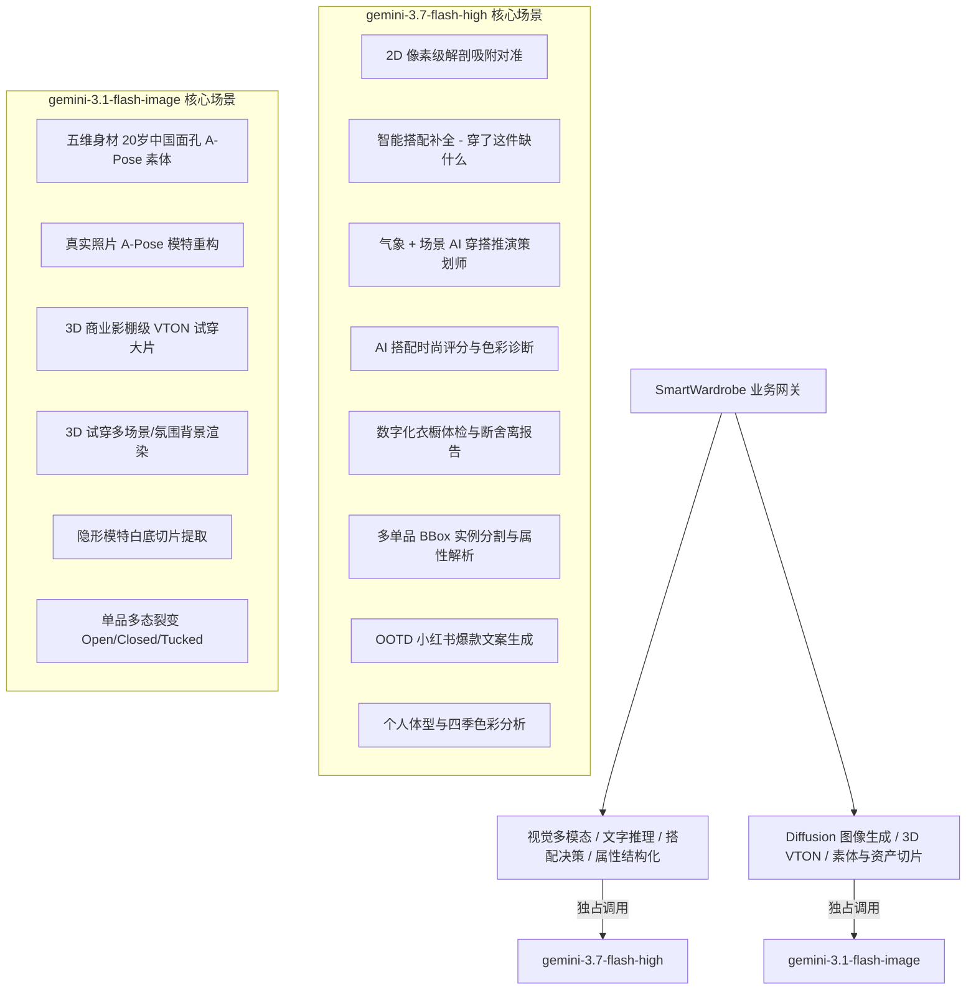

# 全局 AI 深度赋能与功能升级实施计划 (Implementation Plan)

本项目旨在基于**独占双模型架构**，全面挖掘数字化衣橱、自由大画布虚拟试衣间、OOTD 穿搭日历、好友社交与 CMS 管理后台中所有可深度赋能 AI 的业务场景，彻底淘汰本地假数据、Mock 算法与硬编码规则，打造 100% 真实智能、奢品级质感的全智能衣橱与虚拟试衣平台。

---

## 🎯 模型独占绑定与技术底座 (Strict Model Mapping)

所有 AI 场景均严格按照下述分工，绝不引入多余模型或静态兜底：

---

## 📋 待用户确认事项 (User Review Required)

> [!IMPORTANT]
> **分批推进策略**：为保证各模块开发与交付的稳定性，我们将所有 20 个 AI 场景划分为 3 个阶段。请审核各阶段的任务优先级。

> [!TIP]
> **积分经济与算力成本控制**：
> - 纯文字/多模态推理类（搭配补全、体检报告、穿搭文案、解剖吸附）：**免费或仅扣 1 积分**；
> - 图像生成类（素体生成、单品切片）：**1 积分/次**；
> - 3D 试穿大片及复杂背景渲染：**5 积分/次**；
> - 所有失败任务自动触发 `db.refundCredits` 全额退款。

---

## ❓ 开放问题与用户选择 (Open Questions)

> [!IMPORTANT]
> 1. **首批上线范围**：您希望我们在获得批准后，直接开始推进 **第一阶段 (P0: 核心试穿与智能决策闭环)**，还是有特定单独的模块（例如：搭配补全 / 衣橱体检 / 场景背景切换）希望优先单独上线？
> 2. **3D 试穿背景偏好**：多场景 3D 大片首批预设背景是否包含：`纯白影棚`、`巴黎街头`、`艺术馆长廊`、`阳光海滩`、`高级写字楼`？是否有其他您期望的特定场景？

---

## 🏗️ 详细架构与分期实施方案 (Proposed Changes)

---

### 第一阶段：P0 核心试穿与智能决策闭环 (Phase 1)

#### 1. 试衣间大画布【✨ AI 智能搭配补全】(`gemini-3.7-flash-high`)
- **功能设计**：用户在画布上穿戴了 1~2 件单品后，点击悬浮工具栏【✨ AI 搭配补全】。后端分析当前已穿单品的颜色、材质、风格与版型，从私有衣橱（或官方公共库）中智能补全缺失类目（如自动选出配饰发冠、下装短裙或外套），并触发像素级对齐自动上身。
- **涉及文件**：
  - `[MODIFY]` [aiService.ts](file:///d:/项目/换装/server/src/aiService.ts)：新增 `recommendOutfitCompletion` 方法；
  - `[MODIFY]` [index.ts](file:///d:/项目/换装/server/src/index.ts)：新增 `POST /v1/ai/complete-outfit` 路由；
  - `[MODIFY]` [FittingStudioView.tsx](file:///d:/项目/换装/web/src/views/FittingStudioView.tsx)：增加【AI 智能补全】交互按钮与一键穿戴动效。

#### 2. “今天穿什么”【气象 + 场合多维 AI 智能穿搭策划师】(`gemini-3.7-flash-high`)
- **功能设计**：彻底废除 `CapsuleSlotMachine.tsx` 中的前端伪随机规则，转为向后端提交城市/温度/天气及用户选择的场合（职场通勤、周末约会、运动休闲、重要晚宴），由 AI 综合推演出符合当下天气与场景的整套穿搭公式与专业造型理由。
- **涉及文件**：
  - `[MODIFY]` [aiService.ts](file:///d:/项目/换装/server/src/aiService.ts)：新增 `generateWeatherAndOccasionOutfit` 方法；
  - `[MODIFY]` [index.ts](file:///d:/项目/换装/server/src/index.ts)：重构 `GET /v1/outfits/slot-machine` 路由；
  - `[MODIFY]` [CapsuleSlotMachine.tsx](file:///d:/项目/换装/web/src/components/CapsuleSlotMachine.tsx)：增加场合下拉选择，对接后端真实 AI 接口。

#### 3. 一拍多衣全自动多单品拆解与入库链路 (`gemini-3.7-flash-high` + `gemini-3.1-flash-image`)
- **功能设计**：移除 `WardrobeGalleryView.tsx` 中的本地 mock 数组，用户上传单张含多件衣物的照片，后端通过 `gemini-3.7-flash-high` 给出多单品精确 BBox 与属性，`gemini-3.1-flash-image` 并行生成透明底切片并直接入库。
- **涉及文件**：
  - `[MODIFY]` [WardrobeGalleryView.tsx](file:///d:/项目/换装/web/src/views/WardrobeGalleryView.tsx)：对接 `/v1/garments/auto-detect-upload` 真实多切片预览。

---

### 第二阶段：P1 视觉质感跃迁与衣橱体检分析 (Phase 2)

#### 4. 3D 试穿大片【多场景氛围背景渲染】(`gemini-3.1-flash-image`)
- **功能设计**：在 3D 大片生成面板增加【拍摄场景选择器】（巴黎街头 / 艺术馆 / 摩登夜景 / 阳光海滩 / 纯白影棚），AI 在渲染试穿大片时自动匹配对应的高质感光影、环境反光与景深虚化。
- **涉及文件**：
  - `[MODIFY]` [aiService.ts](file:///d:/项目/换装/server/src/aiService.ts)：`renderVtonWithAI` 支持 `sceneBackground` 参数；
  - `[MODIFY]` [pipeline.ts](file:///d:/项目/换装/server/src/pipeline.ts)：透传场景背景参数给渲染管线；
  - `[MODIFY]` [FittingStudioView.tsx](file:///d:/项目/换装/web/src/views/FittingStudioView.tsx)：增加场景选择器弹窗。

#### 5. AI 搭配实时时尚打分与色彩和谐度诊断 (`gemini-3.7-flash-high`)
- **功能设计**：在画布右侧显示【AI 时尚诊断仪】，实时给出当前穿搭的评分（如 95 分）、色系搭配评估（同色系/撞色/互补色）、版型比例分析（上紧下松/外松内紧）及提升建议。
- **涉及文件**：
  - `[MODIFY]` [aiService.ts](file:///d:/项目/换装/server/src/aiService.ts)：新增 `evaluateOutfitStyling` 方法；
  - `[MODIFY]` [DressingCanvas.tsx](file:///d:/项目/换装/web/src/components/DressingCanvas.tsx) 或 [FittingStudioView.tsx](file:///d:/项目/换装/web/src/views/FittingStudioView.tsx)：添加评分与诊断抽屉。

#### 6. AI 数字化衣橱体检报告与智能断舍离 (`gemini-3.7-flash-high`)
- **功能设计**：在衣橱界面增加【衣橱体检】入口。AI 全盘扫描用户的所有单品，输出《衣橱诊断报告》：色系占比分析、风格失衡预警、闲置率统计、胶囊置装推荐（“添置 1 件即可激活 5 件闲置单品”）。
- **涉及文件**：
  - `[MODIFY]` [aiService.ts](file:///d:/项目/换装/server/src/aiService.ts)：新增 `generateWardrobeHealthReport` 方法；
  - `[MODIFY]` [index.ts](file:///d:/项目/换装/server/src/index.ts)：新增 `GET /v1/wardrobe/health-report` 路由；
  - `[NEW]` [WardrobeHealthModal.tsx](file:///d:/项目/换装/web/src/components/WardrobeHealthModal.tsx)：体检报告展示面板。

#### 7. OOTD 穿搭日记与小红书爆款文案生成 (`gemini-3.7-flash-high`)
- **功能设计**：在 OOTD 日历中，点击【✨ 生成社交文案】，AI 自动提炼当日搭配亮点、气象与心情，生成小红书/朋友圈风的穿搭日记与热门 Hashtags。
- **涉及文件**：
  - `[MODIFY]` [aiService.ts](file:///d:/项目/换装/server/src/aiService.ts)：新增 `generateSocialCaptionForOutfit` 方法；
  - `[MODIFY]` [OotdGalleryView.tsx](file:///d:/项目/换装/web/src/views/OotdGalleryView.tsx)：增加一键生成与复制文案功能。

---

### 第三阶段：P2 深度个性化与社交运营扩展 (Phase 3)

#### 8. AI 身材体型诊断与黄金比例穿搭建议 (`gemini-3.7-flash-high`)
- 自动判定体型（梨形/苹果形/沙漏形/H型/倒三角），生成扬长避短的穿搭法则。

#### 9. 个人四季色彩测试 (Personal Color Analysis) (`gemini-3.7-flash-high`)
- 判定用户属于暖春/冷夏/暖秋/冷冬型人，给出专属色盘。

#### 10. 单品多态自动裂变切片生成 (`gemini-3.1-flash-image`)
- 外套自动生成【敞开 Open】与【系扣 Closed】双切片；上衣生成【下摆外放】与【塞衣角】双切片。

#### 11. 好友/情侣穿搭默契度 PK 与寄语润色 (`gemini-3.7-flash-high`)
- 评估两套衣服的风格契合度，推送搭配时自动生成高情商寄语。

#### 12. CMS 官方单品商品详情与营销文案自动生成 (`gemini-3.7-flash-high`)
- 运营人员上传商品图后，一键生成品牌故事、卖点提炼与洗涤保养指南。

---

## 🧪 验证方案 (Verification Plan)

### 自动化与脚本验证
- 编写 Playwright E2E 脚本 (`scratch/test_ai_suite_e2e.js`) 对各阶段新增 API 进行全链路联调；
- 验证所有接口均独占调用 `gemini-3.1-flash-image` 或 `gemini-3.7-flash-high`，HTTP 状态码均为 200；
- 验证失败链路的积分回滚与错误广播机制。

### 视觉与存证校验
- 截取大画布搭配补全、多场景试穿大片、衣橱体检报告等截图存入 Artifact 目录供审查。
